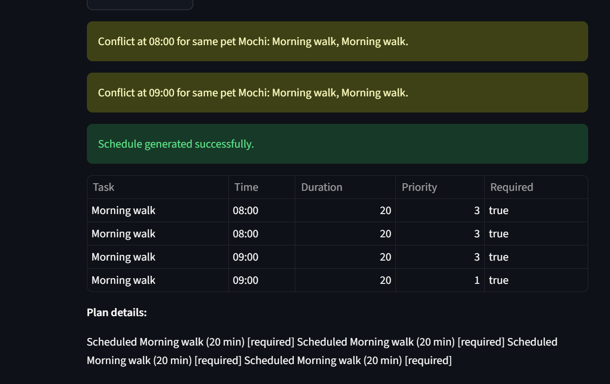

# PawPal+ (Module 2 Project)

You are building **PawPal+**, a Streamlit app that helps a pet owner plan care tasks for their pet.

## Scenario

A busy pet owner needs help staying consistent with pet care. They want an assistant that can:

- Track pet care tasks (walks, feeding, meds, enrichment, grooming, etc.)
- Consider constraints (time available, priority, owner preferences)
- Produce a daily plan and explain why it chose that plan

Your job is to design the system first (UML), then implement the logic in Python, then connect it to the Streamlit UI.

## What you will build

Your final app should:

- Let a user enter basic owner + pet info
- Let a user add/edit tasks (duration + priority at minimum)
- Generate a daily schedule/plan based on constraints and priorities
- Display the plan clearly (and ideally explain the reasoning)
- Include tests for the most important scheduling behaviors

## Getting started

### Setup

```bash
python -m venv .venv
source .venv/bin/activate  # Windows: .venv\Scripts\activate
pip install -r requirements.txt
```

### Suggested workflow

1. Read the scenario carefully and identify requirements and edge cases.
2. Draft a UML diagram (classes, attributes, methods, relationships).
3. Convert UML into Python class stubs (no logic yet).
4. Implement scheduling logic in small increments.
5. Add tests to verify key behaviors.
6. Connect your logic to the Streamlit UI in `app.py`.
7. Refine UML so it matches what you actually built.


Smarter Scheduling:

I added recurring task support so Task objects can now store recurrence and due date, and when a daily or weekly task is completed the system can create the next occurrence automatically. I also added a scheduler method to sort tasks by preferred time, plus a conflict detection method that returns warnings when tasks overlap at the same time, including conflicts for the same pet or across pets. Filtering now supports completion status and pet name, and completing a task can enqueue the next recurring task if needed. Finally, the app now persists Owner and Pet in session state and builds real Task objects from the UI, and the script was updated to exercise the new sorting, filtering, and conflict detection behavior.

Testing PawPal+:

python -m pytest

The tests cover basic task completion and pet task assignment, verify sorting tasks by preferred time, creating the next occurrence for daily recurring tasks, and detecting same-time conflict warnings for both same-pet and cross-pet schedules.

My confidence level is 5 based on the Test Results.


Features:

Owner/pet model with preferences and available time
Task objects with category, duration, priority, preferred time, required flag, completion state, recurrence, and due date
Scheduler planning algorithm that selects tasks based on owner time, required status, preferences, and priority
Scheduler.sort_by_time() to order tasks by HH:MM preferred time
Scheduler.detect_conflicts() to warn about same-time overlaps for the same pet or across pets
Scheduler.filter_tasks() to query tasks by completion status and pet name
Recurring task support: completing a daily or weekly task automatically generates the next occurrence with an updated due date
UI integration that persists owner/pet state, builds real task objects from inputs, and displays sorted schedules and warnings in a table format

Picture Demo:

<a href="Schedule.png" target="_blank"></a>.